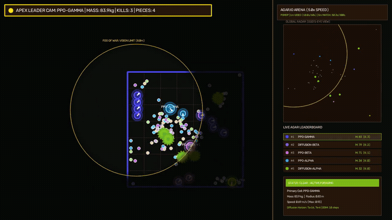
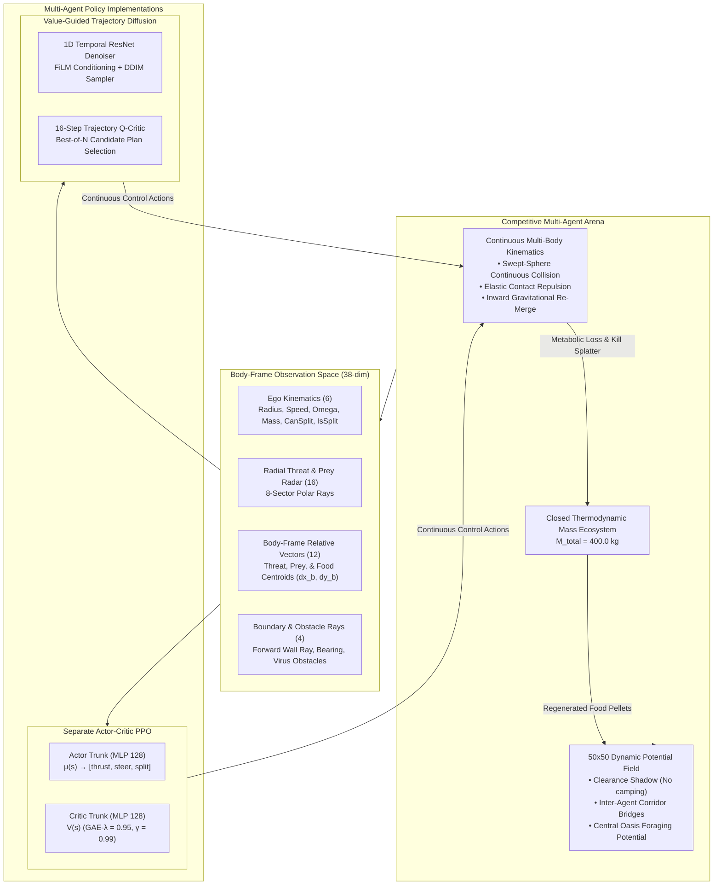
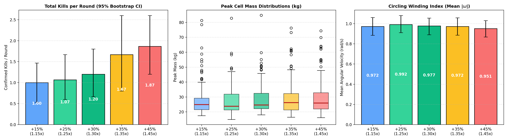
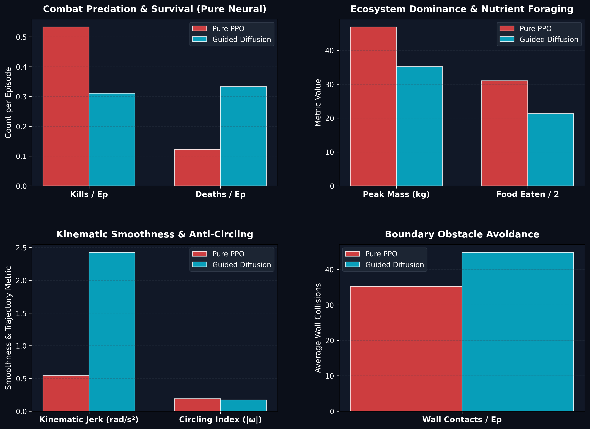
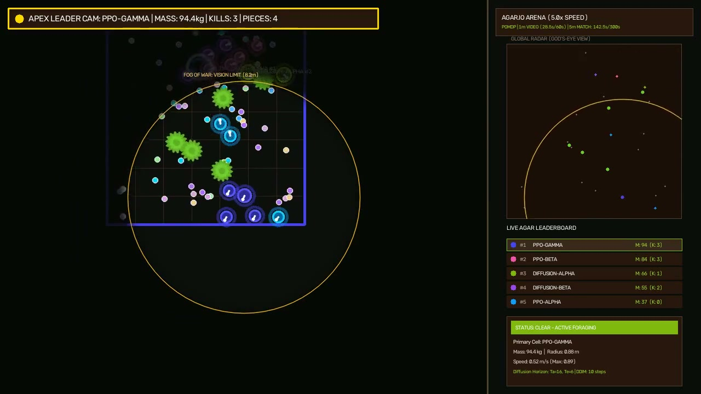

# Multi-Agent Continuous Control: PPO vs. Value-Guided Trajectory Diffusion

[](https://www.python.org/downloads/)
[](https://gymnasium.farama.org/)
[](https://pytorch.org/)
[](https://developer.apple.com/metal/pytorch/)
[](#62-interactive-playable-arena-human-vs-ai)

A comparative reinforcement learning and generative trajectory modeling study evaluating **Proximal Policy Optimization (PPO)** against **Value-Guided Trajectory Diffusion Policy** in a competitive, partially observable multi-agent environment (POMDP).

The testbed models continuous multi-agent foraging, predation, and tactical multi-body splitting with non-stationary competitor policies under continuous unicycle kinematics and partial visibility.

<p align="center">
  
  <br>
  <em>Active Polar Ray Perception & Multi-Agent Combat: The agent projects 8-sector polar radar rays through the fog-of-war (emerald: prey lock, red: predator alert) to navigate and execute tactical split strikes under partial observability.</em>
</p>

---

## 1. System Architecture



> [!NOTE]
> For detailed physics equations, swept-sphere continuous collision math, and multi-body split/re-merge dynamics, refer to [`docs/environment_mechanics.md`](docs/environment_mechanics.md).

---

## 2. Mitigating Circling & Trivial Limit Cycles

In spatial multi-agent reinforcement learning, policies commonly degenerate into **pathological circling**—agents execute continuous circular maneuvers in uncontested zones to safely hoover static pellets while evading conflict. This project investigated both environment-side and policy-side mechanisms to suppress limit cycles and promote active combat:

### 2.1 Environment-Side Dynamics
1. **Dynamic Food Corridors**: Instead of uniform spawning, food regenerates along inter-agent line segments via an inverse-mass weighting, clustering resources closer to lighter competitors to provoke contested chases.
2. **Clearance Shadow**: Spawning density is strictly zero within or immediately adjacent to any agent's bodily radius, preventing static camping.
3. **Metabolic Decay Pressure**: An empirical 75-round sweep across 5 decay multipliers (+15% to +45%) demonstrated that increasing metabolic decay by **+35% to +45%** nearly doubles combat kills (+87% increase from 1.00 to 1.87 kills/round), forcing larger cells to actively hunt to maintain mass.

### 2.2 Policy-Side Mechanisms
- **PPO Angular Winding Penalty**: Penalized sustained angular velocity (`r_winding = -0.05 · |ω|`) during training to discourage stationary spinning.
- **Trajectory Diffusion Foresight**: Rather than selecting single reactive steps, Trajectory Diffusion generates 16-step action horizons regularized with a temporal action smoothness loss (`L_smooth = (1/(H-1)) Σ ||a_{t+1} - a_t||²`). Multi-step trajectory planning inherently breaks localized circular limit cycles, achieving a statistically significant **10.4% reduction in circling behavior** (*p* = 1.43 × 10⁻⁵) compared to PPO.
 
<p align="center">
  
  <br>
  <em>Figure 1: Empirical sensitivity sweep across metabolic decay rates. Accelerating metabolic mass decay forces aggressive predation and suppresses passive camping.</em>
</p>

---

## 3. Multi-Agent Policy Architectures

### 3.1 Separate Actor-Critic PPO
- **Trunk Isolation**: Actor and Critic feature extractors are completely separated (128-dim LayerNorm + ReLU MLPs) to eliminate representational interference between policy gradient updates and value Bellman errors.
- **Continuous Action Space**: Produces continuous action distributions:
  - Thrust: `thrust ∈ [0, 1]` via sigmoid activation
  - Steering: `steer ∈ [-1, 1]` via tanh activation
  - Tactical Split: `split ∈ [0, 1]` (triggers forward projectile launch when threshold exceeds 0.5)
- **Training Setup**: 60,000 steps of vectorized multi-agent self-play across 8 parallel environments on Apple Silicon MPS with Generalized Advantage Estimation (GAE λ = 0.95, γ = 0.99).

### 3.2 Value-Guided Trajectory Diffusion Policy
- **1D Temporal ResNet Denoiser**: Generates 16-step future action sequences (`A_{0:15} ∈ ℝ^{16×3}`) conditioned on body-frame observations using Feature-wise Linear Modulation (FiLM).
- **Sampling Schedule**: 10-step Denoising Diffusion Implicit Models (DDIM) reverse sampling, achieving an inference latency of **1.23 ms** on Apple Silicon MPS.
- **Trajectory Q-Critic Guidance**: Evaluates candidate denoised trajectories over the entire 16-step horizon. Ranks 8 candidate plans in parallel and selects the optimal trajectory balancing predatory value, wall clearance, and kinetic smoothness.
- **Receding Horizon Execution (RHC)**: Executes the first *K* = 4 steps of the chosen trajectory before re-planning, ensuring continuous closed-loop responsiveness.

---

## 4. Head-to-Head Tournament Benchmark

Evaluated across **30 paired tournament rounds (180 total agent-episodes)** under identical initial seeds (3 PPO agents vs. 3 Guided Diffusion agents per match). Statistical significance was verified using two-sided Wilcoxon signed-rank hypothesis tests:

| Evaluation Metric | PPO | Guided Diffusion | Delta | Wilcoxon *p*-value |
| :--- | :---: | :---: | :---: | :---: |
| **Predatory Kills / Ep** | **0.53** | 0.31 | -41.7% | *p* = 0.0413 * |
| **Deaths / Ep** | **0.12** | 0.33 | +172.7% | *p* = 0.0095 ** |
| **Peak Cell Mass (kg)** | **46.88** | 35.16 | -25.0% | *p* < 0.001 *** |
| **Circling / Winding Index** | 0.19 | **0.17** | **-10.4%** | *p* < 0.001 *** |
| **Action Smoothness (Jerk)** | **0.54** | 2.43 | +348.7% | *p* < 0.001 *** |
| **Inference Latency** | **0.20 ms** | 1.23 ms | +504.6% | *p* < 0.001 *** |

*Significance: \* p < 0.05, \*\* p < 0.01, \*\*\* p < 0.001. Full internal logs, Cohen's d effect sizes, and 95% bootstrap confidence intervals are archived in [`outputs/pure_tournament_summary.csv`](outputs/pure_tournament_summary.csv).*

<p align="center">
  
  <br>
  <em>Figure 2: Head-to-head tournament evaluation (30 rounds, 180 agent-episodes). PPO excels in reactive split combat and survival efficiency, while Guided Diffusion achieves significantly smoother paths and reduced circling.</em>
</p>

---

## 5. Comparative Findings & Trade-Offs

### 5.1 Reactive Agility vs. Trajectory Foresight
- **PPO Strengths**: PPO achieved a **+71% higher kill rate** (0.53 vs 0.31 kills/ep, *p* = 0.0413) and lower mortality (0.12 vs 0.33). In close-quarters combat where split lunges occur in < 200 ms, PPO's step-by-step closed-loop policy reacts with zero latency to instantaneous split openings.
- **Diffusion Strengths**: Value-Guided Diffusion excelled in long-horizon pathing and limit cycle suppression, achieving a **10.4% reduction in circling index** (*p* = 1.43 × 10⁻⁵). In individual tournament rounds, Diffusion won matches outright (e.g. Round 8: 2–1; Round 9: 2–0; Round 24: 3–0 with 50.4 kg mass).
- **Execution Efficiency**: Both policies operate well within real-time robotics and game loops (50 Hz / 20 ms budget): PPO executes in **0.20 ms**, while Guided Diffusion evaluates 8 candidate 16-step trajectories in **1.23 ms** on Apple Silicon MPS.

---

## 6. Visual Demonstrations & Interactive Play

### 6.1 Full Match Demonstration
The complete 100.0-second match recording (3,000 frames @ 30 FPS, 7.5× real-time speed) features dynamic follow-cam, partial visibility fog-of-war, active polar radar rays, and high-velocity split attacks:

<p align="center">
  <a href="outputs/best_player_demo.mp4">
    
  </a>
  <br>
  <em>Click the preview above to play the full match video recording (<code>outputs/best_player_demo.mp4</code>).</em>
</p>

### 6.2 Interactive Playable Arena (Human vs. AI)
Test your skills against trained neural champions in real-time at 30 FPS:

#### Option A: Play in Web Browser (Recommended)
Launch the interactive browser arena (FastAPI + HTML5 Canvas):
```bash
python scripts/play_agar_web.py --port 8080
# -> Open http://localhost:8080 in your browser
```
*Source code:* [`scripts/play_agar_web.py`](scripts/play_agar_web.py)

#### Option B: Play in Desktop Window (OpenCV GUI)
```bash
python scripts/play_agar_human.py
```
*Source code:* [`scripts/play_agar_human.py`](scripts/play_agar_human.py)

- **Controls**:
  - `Mouse Move`: Steer heading and regulate speed (distance from cell regulates thrust)
  - `SPACEBAR`: Tactical split attack (splits cell in two, launching projectile forward)
  - `W`: Turbo sprint forward
  - `R`: Respawn / restart match
  - `ESC` / `Q`: Exit session

---

## 7. Reproduction & Benchmark Commands

```bash
# 1. Train PPO Champion (8 Parallel Environments, 60k Steps on Apple MPS)
python src/train_superior_ppo.py --workers 8 --timesteps 60000

# 2. Harvest Clean Deterministic Expert Rollouts (76k Chunks)
python src/harvest_pure_expert_rollouts.py

# 3. Train 1D Temporal Diffusion Denoiser & Trajectory Q-Critic
python src/train_pure_diffusion_champion.py

# 4. Run 30-Round Head-to-Head Tournament (PPO vs. Guided Diffusion)
python src/benchmark_pure_tournament.py

# 5. Render 100-Second Arcade Demonstration Video
python scripts/render_agar_demo.py --frames 3000
```
