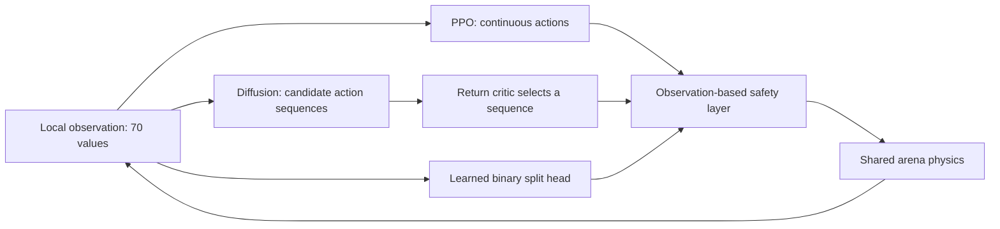

# Sim2Real Agar Control

**Learned navigation and decision-making in a competitive, partially observed world.**

Agents steer through an Agar-style arena, collect food, grow, avoid hazards, and decide when to split to capture smaller opponents. The project brings **PPO**, **action diffusion**, and **rule-based opponents** into the same simulator—and lets you play against the trained agents in a browser.

**Experimental learned splits:** [balanced PPO results and preview](docs/balanced_ppo.md). The best split-head continuation reached 65.74 mean mass versus v8's 58.21, with one death for each on the same eight development cases. It still misses the 90% growth-retention gate and is **not the accepted default**. Splits have only physical constraints; movement assistance remains explicit. [Earlier fresh v8 results](docs/learned_split_risk.md#fresh-v8-results-and-playable-candidate).

[](docs/media/showcase/gameplay.mp4)

**[48-second gameplay video at 2×](docs/media/showcase/gameplay.mp4)** · [Screenshots and demo gallery](docs/media.md) · [Benchmark protocol and raw results](docs/benchmarks.md) · [Run locally](#play-against-the-agents)

*Actual autonomous clashes at 2× speed, starting two playback seconds before the first capture. Blue: PPO; green: diffusion; amber: heuristic opponents; pink: virus hazards. The rectangle marks the spectator clash camera; red rings mark measured captures. The 30-second animation previews a 48.3-second video covering simulator time 23.3–120 seconds.*

## What this project explores

The arena makes navigation harder than steering toward a waypoint: agents have inertia, their speed changes with mass, nearby opponents can be threats or targets, and splitting changes both mobility and vulnerability. Each policy sees a **70-value local observation**, rather than the full map shown to spectators.

- **Continuous control:** choose thrust and steering at a 30 Hz simulation timestep.
- **Limited sensing:** react to visible opponent pieces, relative motion, food, hazards, and boundaries.
- **Discrete decisions:** learn when a split can capture a target without making the launched half too small.
- **Interactive evaluation:** play alongside two PPO agents, two diffusion agents, and two heuristic opponents.

The current deliverable is a **simulation research testbed**. Despite the historical “Sim2Real” name, physical robot transfer has not been demonstrated.

## See what the agents do


The full-arena view and spectator zoom follow real encounters. Capture rings and event labels come from simulator consumption events. Policies still receive local numeric observations, not either rendered view.

[](docs/media/showcase/policy_comparison.mp4)

**[PPO vs diffusion comparison — 60 seconds at 2×](docs/media/showcase/policy_comparison.mp4)**. Each rollout starts with the same positions, masses, food and hazards, with one learned focus agent and six reactive heuristic opponents. The opponents respond independently as the policies diverge. Zoom views, minimaps and focus-agent counters show captures, deaths and actual splits. This is a qualitative comparison, not a direct duel or an additional benchmark win-rate claim.

## Accepted v3 capabilities: benchmarks

These results describe the **accepted v3 models**, with no historical agents in the match roster. Twelve fresh 60-second matches each contain two PPO agents, two diffusion agents, and three heuristic opponents, with shuffled seats. Agents compete individually; sharing a policy does not make them a team.

| Metric | PPO | Diffusion | Heuristic opponents |
| --- | ---: | ---: | ---: |
| Agent runs | 24 | 24 | 36 |
| Mean final mass, simulation units | **51.7** | **47.6** | 31.5 |
| Runs with no full death | **20/24 (83.3%)** | **21/24 (87.5%)** | 22/36 (61.1%) |
| Opponent pieces captured per agent-minute | 0.71 | **0.88** | 0.42 |
| Executed splits, total | 1 | 1 | 12 |
| Mean policy inference on this Mac, CPU | 0.279 ms | 0.525 ms | 0.019 ms |

Inference includes safety checks and was measured under parallel evaluation load; it excludes rendering and is not browser FPS. A full death means losing all pieces; respawns remain part of the match. Mass is a simulator quantity, not a physical measurement.


A separate held-out split test contains **996 valid encounters per learned policy**. PPO captured **120/125 beneficial opportunities (96.0%)** and diffusion **119/126 (94.4%)** with a launched piece. Neither executed a split that violated the current safety checks. These percentages apply to known beneficial opportunities in that test; they are **not game win rates or general combat accuracy**.

The agents still split rarely in ordinary matches. Corner escapes, close predator traps, and wall contacts remain weaknesses; skilled humans can beat them. Twelve simulator seeds do not establish broad generalization. See [definitions, confidence intervals, hardware context, and reproduction commands](docs/benchmarks.md).

## How it works


```mermaid
flowchart LR
    S[Local observation: 70 values] --> P[PPO: continuous actions]
    S --> D[Diffusion: candidate action sequences]
    D --> C[Return critic selects a sequence]
    S --> B[Learned binary split head]
    P --> G[Observation-based safety layer]
    C --> G
    B --> G
    G --> E[Shared arena physics]
    E --> S
```

In accepted v3, PPO uses imitation initialization followed by reinforcement learning. Diffusion learns short action sequences from demonstrations; a return critic ranks candidates, and the agent executes a short prefix before replanning. Both use separately trained binary split decisions and a safety layer that can reject unsafe splits or alter movement near immediate hazards. Splitting is supervised using paired physical trials in which splitting captures a target earlier than holding. The experimental branch removes nonphysical split vetoes and continues learning from growth and death rewards; it retains movement assistance.

The models share the same observation contract and physics. Benchmark runs record seeds, individual agent outcomes, model hashes, and source hashes. The shared-match demonstration extends the first benchmark seed to 120 simulator seconds. The paired comparison uses seed 4200001. These active recordings are separate from the twelve 60-second benchmark matches.

## Play against the agents

From the repository root, using Python 3.9+:

```bash
python -m pip install -r requirements.txt
python scripts/play_agar_web.py --host 127.0.0.1 --port 8080
```

Open **[localhost:8080](http://localhost:8080/)**. Move the mouse to steer, hold **W** to sprint, press **Space** to split, and press **R** to reset the match.

Accepted weights are included in the repository. The server checks the deployment manifest and rejects missing, incompatible, or checksum-mismatched models. `/status` exposes readiness, model hashes, and the control timestep. The GitHub videos are recordings; the interactive game runs locally.

To try the unaccepted balanced split checkpoint separately:

```bash
python scripts/play_agar_web.py --port 8081 --policy-dir outputs/balanced_split_v11/experimental
```

Open [localhost:8081](http://localhost:8081/). Its banner explicitly shows the failed development growth gate; no unseen acceptance result is claimed.

## Reproduce and explore

| Resource | What it contains |
| --- | --- |
| [Demo gallery](docs/media.md) | Gameplay and split videos, animations, screenshots, and recording provenance |
| [Current benchmarks](docs/benchmarks.md) | Absolute metrics, test definitions, raw data, and commands |
| [Navigation training and checkpoint history](docs/checkpoint_history_2026-10-27.md) | Training recipes and historical comparisons |
| [Split training and limitations](docs/split_combat_results_2026-10-27.md) | Paired split/hold curriculum, acceptance gates, and failure modes |
| [Balanced PPO continuation](docs/balanced_ppo.md) | Controlled same-seat comparisons, rejected movement trials, split learning and experimental preview |
| [Current benchmark data](outputs/showcase_v1/benchmark.json) | All twelve match results, time series, seeds, and hashes |
| [Training and simulator source](src/) | PPO, diffusion, inference wrappers, benchmarks, and diagnostics |

Run existing regression checks with `python -m unittest discover -s tests -v`. To recreate the media, install the optional [media-build dependencies](requirements-media.txt) and follow the [gallery instructions](docs/media.md#rebuild-the-showcase).
